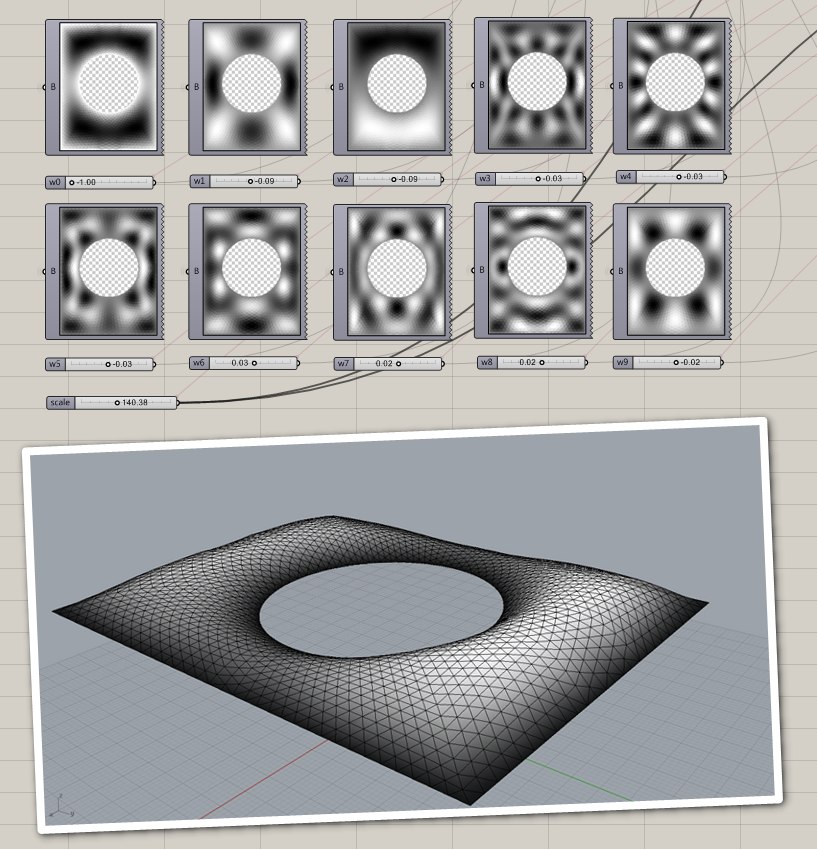
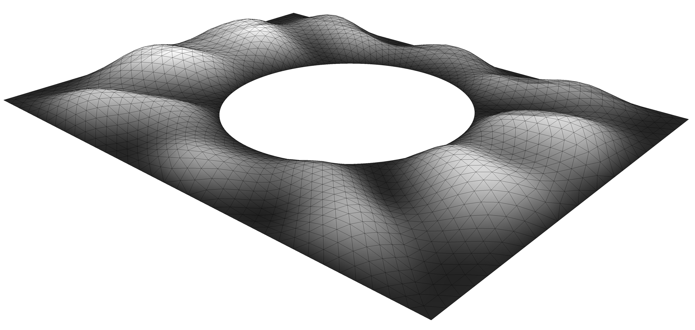

Harmonics
=============
This plug-in is an implementation of a novel free-form shell modelling technique based on harmonics. The method extends classical Fourier theory to three-dimensional mesh surfaces and is specifically adapted to an architectural design context. This enables beneficial shape analysis whilst sculpting free-form surfaces using only a few control parameters. The resulting shape, inherently rich in curvature, is an effective means of stiffening a shell against failure by buckling.

Installation
============
Find the latest compiled gha file under releases.

Dependencies
============
Install the following plugins:

[Math.Net Numerics](https://numerics.mathdotnet.com/)

[Plankton](https://github.com/meshmash/Plankton/releases)

[Squid](http://www.food4rhino.com/app/squid)

Feedback and enhancements
=========================
Please report any bugs or requests for enhancement in the GitHub issue tracker.

License
=======
This software is licensed under the Apache 2 license: http://www.apache.org/licenses/LICENSE-2.0

Acknowledgement
===============
Thanks to Paul Shepherd and Paul Richens from the University of Bath

Literature
===============
The theory behind the implementation is described here:
https://researchportal.bath.ac.uk/en/publications/harmonic-form-finding-for-the-design-of-curvature-stiffened-shell